<h3><code>happy@github ~ $ ./contributions.sh</code></h3>

  

<h3><code>happy@github ~ $ whoami</code></h3>
<table>
  <tr>
    <td valign="top"></td>
    <td valign="top"></td>
  </tr>
</table>

 

<h3><code>happy@github ~ $ open links</code></h3>
<a href="https://happygarg.vercel.app/"><code>portfolio</code></a> &nbsp;·&nbsp;
<a href="https://linkedin.com/in/happy-garg"><code>linkedin</code></a> &nbsp;·&nbsp;
<a href="https://github.com/HappyGarg8o?tab=repositories"><code>repos</code></a>

